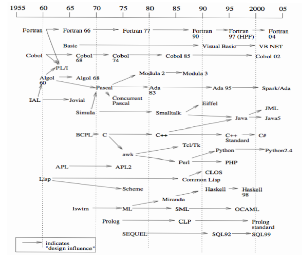
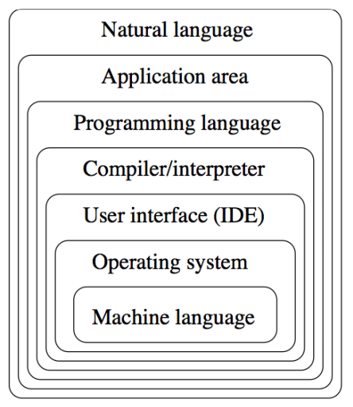
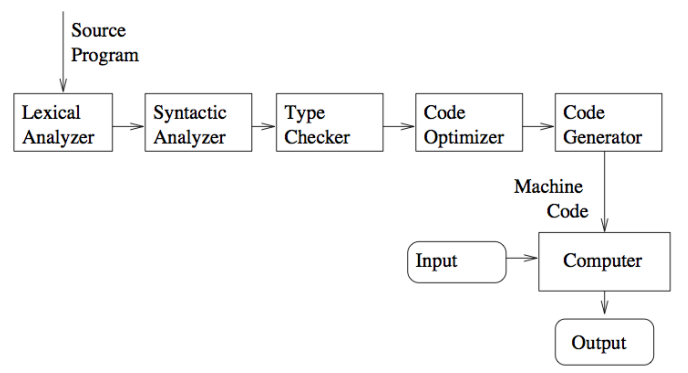
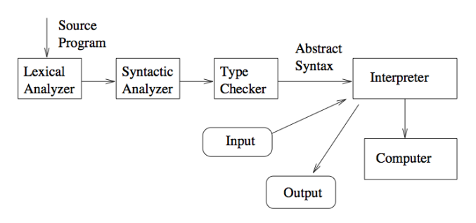

---
tags:
  - cs152
---
## History

- Artificial Intelligence
	- Prolog, CLP, (Python)
- Computer Science Education
	- Pascal, Logo
- Science and Engineering
	- Fortran, Ada, ML, Haskell
- Information Systems
	- Cobol, SQL
- Systems and Networks
	- C, C++, Perl, Python
- World Wide Web
	- HTML, Java, JavaScript, PHP
## Language Design
### Design Constraints
- Computer architecture
- Technical setting
- Standards
- Legacy systems
### Design Outcomes and Goals
## Abstraction

- Inside machine language would be voltages in a substrate
## Successful Languages
### Simplicity and readability
- Ease of learning
- Ease of programming
### Clarity about binding
- An element is bound to a property at the time that property is defined for it
- Binding is the association between an object an a property of that object
### Reliability
- Same behavior across platforms
- Type errors detected
- Semantic errors trapped
- Memory leaks prevented
### Support
- Public domain compilers and interpreters
- Good documentation
- Wide community
- Integrated with IDEs
### Abstraction
- Data
- Procedural
### Orthogonality
- Features build upon a small, mutually independent set of primitive operations
### Efficient implementation
- Embedded systems
- Web applications
- Corporate database applications
- AI applications
## Compilers and Virtual Machines
- Compiler
	- Produces machine code
- Interpreter
	- Executes instructions on a virtual machine
- Examples
	- Compiled
		- Fortran, Cobol, C, C++
	- Interpreted
		- Scheme, Haskell, Python
	- Hybrid
		- Java Virtual Machine (JVM)
### Compiling Process

### Interpreting Process
