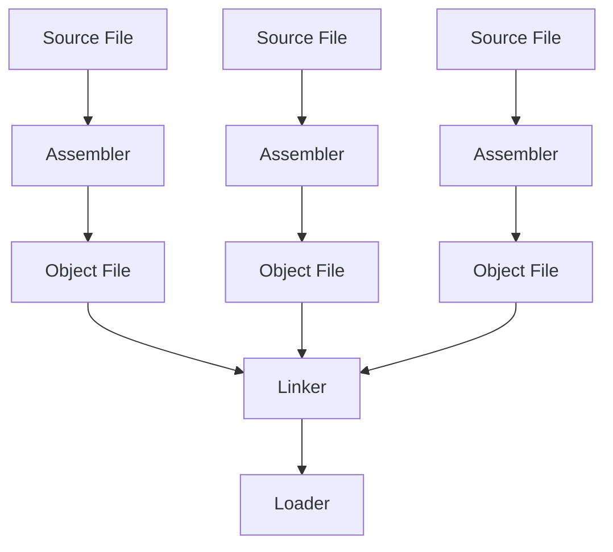

## Assembler
### Label
- Used for things like [jump instructions](3%20-%20Programming%20a%20Computer.md#^72cc66) and loops
#### Relative Addressing
- The instruction (usually line) number
### Lexemes
- Breaking down each line of the MIPS code