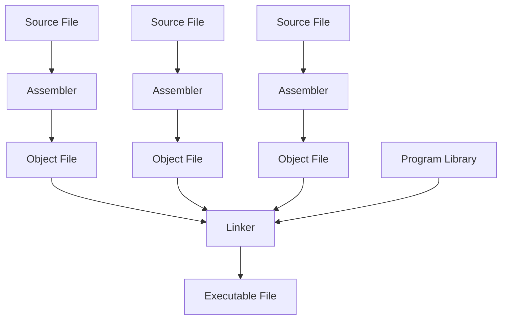

## Assembler
### Passes
#### First Pass
- Relative addressing
- Symbol table
#### Second Pass
- Creates hexadecimal instructions
- Compiles these instructions to an object file
### Labels
- Used for things like [jump instructions](3%20-%20Programming%20a%20Computer.md#^72cc66) and loops
#### Forward Reference
- Referencing a symbol/label that is after the current one
#### Relative Addressing
- The (relative) instruction number
- First pass
#### Global Labels
- `.glob LABELNAME
- Only available to other programs if specified as global
	- Otherwise the label is local
### Lexemes
- Breaking down each line of the MIPS code
### One Pass Assembler
- RISC vs CISC
- How instructions are loaded into memory
- How data is stored in HDD vs instructions loaded in memory
- Forward references - needs to be patched later
## Object File
- List of machine instructions in hexadecimal
## Linker
- Some symbol table entries are passed to the linker
## Additional Facilities
### Data Layout Directives
- Provides easier way to describe data
- You have constants and predefined global variables stored in specific locations
### Macros
- `.macro`
- User written
- Provides way to shorten code writing for repetitive codes
### Pseudo Instructions
- Combines two or more fundamental instructions into one instruction
- Not user defined like a macro