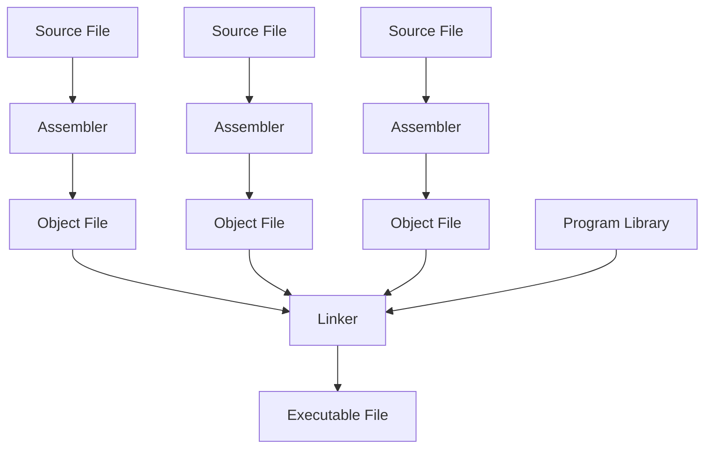

---
tags:
  - cs47
---


## Assembler
### Passes
#### First Pass
- Relative addressing
- Symbol table
#### Second Pass
- Creates hexadecimal instructions
- Compiles these instructions to an object file
### Labels
- Used for things like [jump instructions](Programming%20a%20Computer.md#^72cc66) and loops
#### Forward Reference
- Referencing a symbol/label that is after the current one
#### Relative Addressing
- The (relative) instruction number
- First pass
#### Global Labels
- `.glob LABELNAME
- Only available to other programs if specified as global
	- Otherwise the label is local
### Lexemes
- Breaking down each line of the MIPS code
### One Pass Assembler
- RISC vs CISC
- How instructions are loaded into memory
- How data is stored in HDD vs instructions loaded in memory
- Forward references - needs to be patched later
## Object File
- List of machine instructions in hexadecimal
## Linker
- Some symbol table entries are passed to the linker
- The output of the linker is an exe file
	- Similar format as the object file, but it does not contain any unresolved references or relocation information
## Loader
- Loads executable into memory and starts the program to execute on the system
	- Determines size of text and data segment
	- Creates new address space for the program
	- Copies instruction and data from executable file to memory
	- Copies arguments to be paused to the program onto the stack
	- Initialize machine registers - stack pointer to point to free stack location
	- Jumps to the main startup routine
## Additional Facilities
### Data Layout Directives
- Provides easier way to describe data
- You have constants and predefined global variables stored in specific locations
#### String Layout
- Assembler support `.asciiz` / `.ascii` directives to define string in a natural way
- String is stored in the memory as ascii code (usually byte long)
- Assembler converts the defined string into into equivalent multi-byte storage
### Macros
```asm
.macro macro_name ($arg)
	macro_body
.end_macro
```

- User written
- Provides way to shorten code writing for repetitive codes
- String pattern matching matches a 'name' and replaces it with a sequence of code
- Not a function because it does string replacement directly
### Pseudo Instructions
- Combines two or more fundamental instructions into one instruction
- Not user defined like a macro